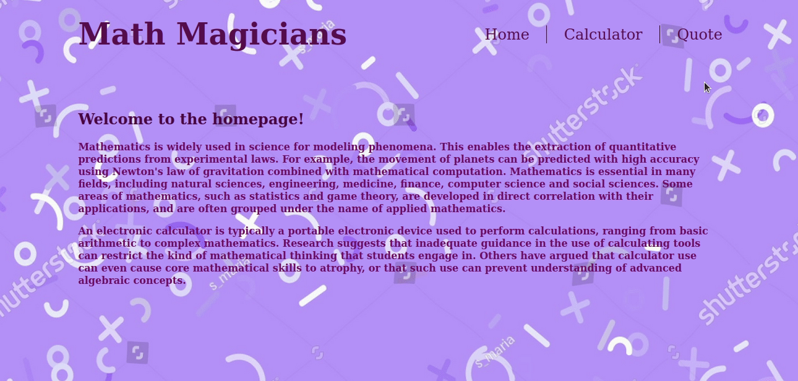

# math-magicians


> math magicians" is a website for all fans of mathematics. It is a Single Page App (SPA) that allows users to: make simple calculations and read a random math-related quote.



## Setup

### Clone this repository

```bash
$ git clone git@github.com:Sahar-AbdelSamad/math_magicians.git
$ cd math_magicians
```

### Run project

```bash
$ npm install
$ npm run start
```

### Run tests

To run the test just use the following command!

```bash
$ npm test
```

## Live Demos

- [Github Deployment](https://sahar-abdelsamad.github.io/math_magicians/)
- [Heroku Deployment](https://math-magicians-deployheroku.herokuapp.com/)
- [Netlify Deployment](https://math-magicians-sahar.netlify.app/)


## Built With

- React
- Webpack
- JavaScript
- CSS

## Authors

👤 **Sahar Abdel Samad**

- GitHub: [@sahar-abdelsamad](https://github.com/Sahar-AbdelSamad)
- Twitter: [@abdelsamadsahar](https://twitter.com/AbdelSamadSahar)
- LinkedIn: [abdel-samad-sahar](https://www.linkedin.com/in/sahar-abdel-samad/)

## 🤝 Contributing

Contributions, issues, and feature requests are welcome!

Feel free to check the [issues page](https://github.com/Sahar-AbdelSamad/math-magicians/issues).

## Show your support

Give a ⭐️ if you like this project!
